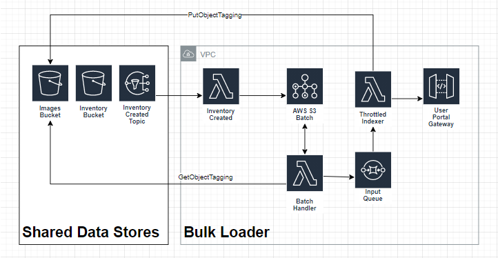

# Bulk Loader Service

## What is the high-level flow

1. The [Shared Data Storage](../storage) contains an **image bucket**, where administrators can centralize their registration information.  Amazon S3 Inventory enumerates all files within the bucket daily (configurable) and persists this information into **inventory bucket**.  This operation triggers a **ObjectCreatedNotification** from S3 that forwards to the SNS Topic **InventoryCreated**.

1. This notification triggers the [Bulk Loader Inventory Created Handler](inventory_created.py) to process the report.  The function converts the report into an **S3BatchOperations_CSV_20180820** compatible format.  Finally, it uses the `s3:CreateJob` method to fan-out importing the list.

1. Amazon S3 Batch enumerates through the list and passes each item to the [RivBulkLoaderBatchHandler](batch_handler.py).  This function determines the current item qualifies for import (e.g., valid format).  The historical importation information resides in an Amazon S3 Object Tags.  After disqualifying files, the remaining forward into an Amazon SQS Queue (aka Riv Throttled Input Queue). 

1. The [RivBulkLoaderThrottledIndexer](throttled_indexer.py) pulls from the **Input Queue** and forwards them into the [UserPortal Gateway](../userportal/gateway).  After confirming the Gateway is successful, the function updates the **Import History** table.  Finally, the message is removed from the queue.



## What S3 ObjectTags are supported

The bulk importer identifies any supported image (`*.png` and `*.jpeg` files) and examines the associated tags.


| Tag Key | Expected Format | Description|
|---------|-----------------|------------|
| UserId | Unicode string (128 char max) | Required name of the user to create |
| Properties  | s3://bucket/path/properties.json| Optional path to Amazon S3 file containing the user's property bag
| Indexed | True or False  | Marker denoting the object has been imported |
| Ignore | True or False | Marker denoting the object should never be processed |

## What is the expected format for properties.json

The user's properties.json must deserialize into a `Mapping[str,str]` data structure.  Extending this functionality would require extending the [Index-Face's StorageWriter](../../src/rekognition/index-faces/storage.py).  Additionally, the entire user record in DynamoDB cannot exceed 400KB.

```json
{
    "fname": "Fred",
    "lname": "Flintson",
    "address": "345 Cave Stone Road"
}
```
