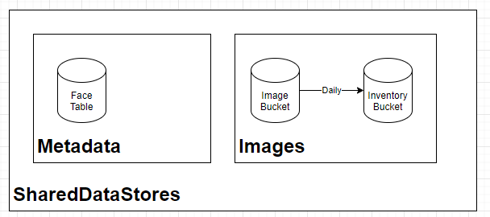

# Storage Constructs

The [RivSharedDataStores](topology.py) is the main module export, and creates all shared data stores.

## What is the FaceTable

The [RivStorageFaceMetadata](face_metadata.py) construct contains an Amazon DynamoDB.  Customers can extend this to include custom encryption keys and additional supporting functions.

## What is the Image Store

The [RivStorageImageStore](face_images.py) holds face images for bulk loading operations.  An Amazon S3 Full Inventory runs daily, then raise the `InventoryCreated` notification through an Amazon SNS Topic.

