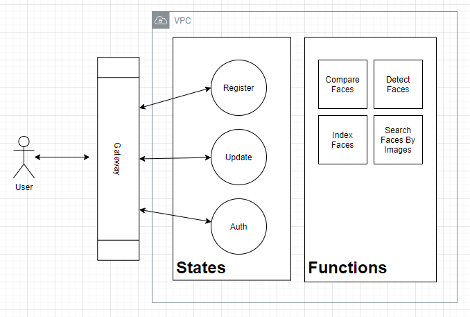

# User Portal

Represents the public interface for end-user registration, profile updates, and authentication requests.

## Where is the Amazon Lamba function code

- [src](../../src) is the root source folder
  - [rekognition](../../src/rekognition) holds the functions for the user flow

## How is the infrastructure organized

- [topology.py](topology.py) represents the main export construct
- [gateway.py](gateway.py) declares the Amazon API Gateway
- [states.py](states.py) declares the userflows using Amazon Step Function Express
- [functions](functions) declares the Amazon Lambda tasks that support the user flows

